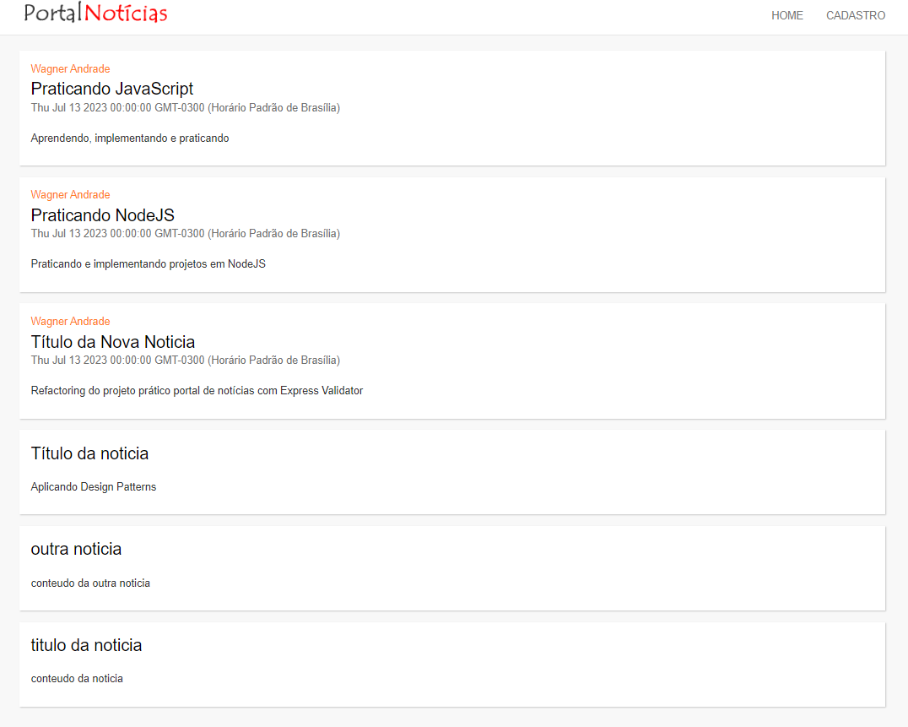

# 📂 Portal de Notícias com NodeJS

## 📃 Projeto desenvolvido implementando arquitetura MVC e Design Patterns

 

## 🚀 Tecnologias

- HTML
- Bootstrap
- JavaScript
- Node
  - Body-parser
  - EJS
  - Express
  - Express Validator
  - MySQL
  - Nodemon

 

## 💻 Projeto
> Frontend da aplicação 📸

  

<!-- [Acessar o projeto](https://wsawebmaster.github.io/portfolio/) -->

 

Necessário instalar o [NodeJS](https://nodejs.org/en/download) e [MySQL](https://dev.mysql.com/downloads/installer/) 
`npm install`  
`http://localhost:3000`

---
✔ Ganhando produtividade com o NPM,  Express, EJS e Nodemon

✔ Modulando nosso projeto com CommonJS

✔ Conectando ao banco de dados MySQL

✔ Models e ganhando produtividade com Consign (sucessor do Express-Load)

✔ Recebendo dados de formulários com Body-parser

✔ Implementando classes em JavaScript

✔ Ganhando produtividade com o Express Validator

✔ Implementando controllers e entendendo o designer pattern MVC

✔ Utilizando recursos estáticos como imagens, arquivos de estilo e scripts

---

Em caso de dificuldades ao acessar o MySQL

  - Vá no diretório `C:\Program Files\MySQL\MySQL Server 8.0\bin` e acesse via prompt de comando
  `mysql -u root -p` digite a senha configurada durante a instalação `1234`

    `ALTER USER 'root'@'localhost' IDENTIFIED BY '1234';`

    `ALTER USER 'root'@'localhost' IDENTIFIED WITH mysql_native_password BY '1234';`

---
---
## 📧 Contato
[LinkedIn](https://www.linkedin.com/in/wsawebmaster/)

wsawebmaster@yahoo.com.br
